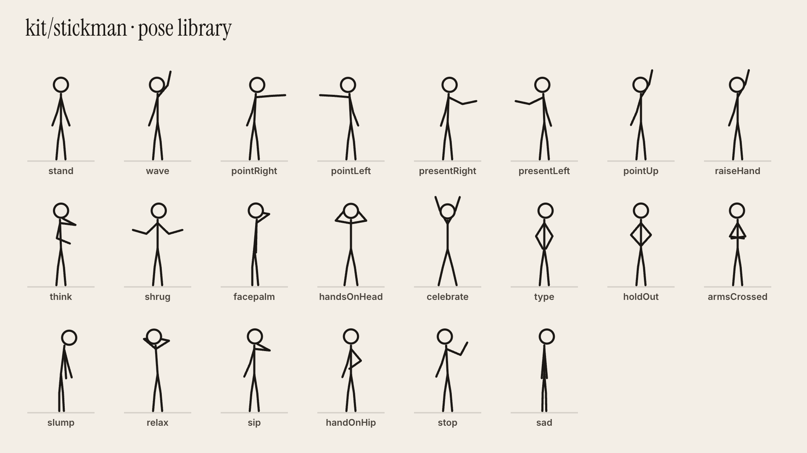

# kit/stickman — stickman moments

An ink-line stick figure for HyperFrames compositions, drawn to sit inside the `preset_paper_studio` look: ink on paper, plus one orange accent. It is free, local and deterministic, and it is timed to the word.



Demo: `stickman_demo.mp4` / `stickman_demo.gif` (6 s, "2 days of work… gone."), with source in `demo/index.html`.

## When to use it (the rule)

**Stickman moments are seasoning, not the meal.** The speaker stays the star of every video.

- **2 to 4 moments per video, 2 to 5 s each.** Never a whole video, and never two moments back to back.
- **Use one only where it explains or lands something better than a card can:**
  - a **visual metaphor** ("one big prompt": he drops a video into a box and junk comes out);
  - a **story beat with emotion** ("2 days… gone": typing, shock, facepalm);
  - a **process you can act out** ("15–20 min": he sips chai while the render bar fills);
  - a **before / after** (frustrated at a timeline editor, then relaxed while Claude edits);
  - a **role** (two figures: "you" vs "the editor", or "me" vs "my agent").
- **Don't use it** for facts, numbers, screenshots, lists or anything the real screen shows better. Those stay as cards, windows and the speaker.
- Mount it as a full-screen `insert()` (with or without the corner face), or as a `side()` beside the speaker over the wall.
- **The figure never idles.** The `bob` loop is always on, and every moment needs a concrete action: typing, pointing, grabbing his head, sipping, walking.
- **Up to three accent colours** (orange, plus green for ✓ and muted ink), and the same line weight everywhere.

## API

```html
<script src="vendor/gsap.min.js"></script>
<script src="vendor/stickman.js"></script>   <!-- copy kit/stickman/stickman.js into the film's vendor/ -->
```

```js
const fig = Stickman.create(parentEl, { x: 600, ground: 905, scale: 1.5 });   // svg overlay 1920x1080 (or pass an <svg>)
fig.set("type");                                  // pose at t = 0 (a name from Stickman.POSES, or {joint: deg})
fig.loop("type", 0, 2.25);                        // additive motion loop, fades in and out over 0.15 s
fig.to(2.28, { ...Stickman.POSES.handsOnHead, lift: 14 }, 0.16, "power3.out");   // move toward a pose: start, duration, ease
fig.to(2.46, { lift: 0 }, 0.25);                  // partial poses merge (x, lift and s move the whole figure)
fig.to(3.0, "facepalm", 0.42);
fig.hold(Stickman.props.cup(), "handR", 1, 3);    // keep a prop in a hand between t = 1 and 3
const head = fig.at(2.4, "head");                 // joint position at a time, for placing emotes and labels
Stickman.drive(tl, totalSeconds);                 // ONCE, after every figure is set up: one linear proxy redraws all
```

- **Poses** (see `poses.png`): `stand wave pointRight pointLeft presentRight presentLeft pointUp raiseHand think shrug facepalm handsOnHead celebrate type holdOut armsCrossed slump relax sip handOnHip stop sad`.
- **Loops**: `bob` (always on), `type`, `walk` (pair it with `fig.to(t, {x}, dur)`), `wave`, `nod`, `shake`, `clap`, `jump`.
- **Joints** (degrees): `torso neck shL elL shR elR hipL knL hipR knR`. 0 means the limb points down; positive swings toward screen-right. Arms are relative to the torso, forearms and shins to their parent. Plus `x` (px), `lift` (units) and `s` (scale).
- **Props**:
  - `desk(svg,x,y,w)`, `monitor(svg,x,y,w,h)` → `{g, screen, x, y, w, h}` (draw content in `screen`), `keyboard(svg,x,y,w)`, `box(svg,x,y,w,h)` → `{g, lid}`;
  - held props for `fig.hold`: `cup()` and `file(label)`.
- **Emotes**: `Stickman.emote(svg, kind, x, y, size)` with `exclaim question sweat spark shock bulb check cross zz`. It returns the inner group, so GSAP can scale and move it while the parent keeps its position.

## How it stays exact

The pose is a pure function of time: keys and loops are data, and `drive()` adds one linear proxy tween whose `onUpdate` redraws every figure. Seeking to any frame (HyperFrames renders out of order) always gives the same picture. Don't tween the figure's SVG with GSAP directly; tween props, emotes and the text around it.

## Build and preview

```
sh kit/stickman/build.sh                      # copies the rig, gsap and fonts into sheet/ and demo/
cd kit/stickman/sheet && npx hyperframes snapshot --at 0.5 --no-end --describe false -o out   # pose sheet
cd kit/stickman/demo && npx hyperframes render -o ../stickman_demo.mp4 --fps 30 --quality delivery
```

When adding a pose: add it to `POSES`, rebuild the sheet, and look at it. Arms raised past about 140° pass behind the head, and the inward forearms of `type` and `holdOut` cross if they're folded past about 60–80°.

## Ideas for the next videos (reuse, don't redraw)

| Moment | Staging |
|---|---|
| One big prompt | the figure drops a `file()` into a `box()`; the lid pops, junk flies out; `shrug` |
| 2 days… gone | the demo: `type` at the desk, the screen goes blank, `handsOnHead` + `shake`, `facepalm` + sweat |
| 15–20 min | `relax` / `sip` holding `cup()` while a progress bar fills on the `monitor` |
| Timeline vs code | two figures: the left one `slump` at a cluttered timeline, the right one `celebrate` beside a code window |
| Me + my agent | two figures, the second at 0.8 scale with an orange "agent" dot on its head, passing a `file()` |
